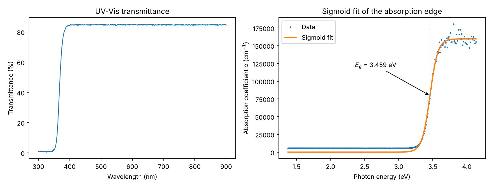

# Optical Band Gap of AZO Thin Films from UV-Vis Data

A small, tested Python pipeline that estimates the **optical band gap** of a thin film from its UV-Vis transmittance spectrum.

It reproduces the analysis I carried out in 2023 for an experimental physics project, where aluminum-doped zinc oxide (AZO) thin films were deposited on glass substrates and optical fibers by DC magnetron sputtering to evaluate their potential for optical sensors.



## Original result

With the experimental spectrum of a 300 nm AZO film, this method gave a band gap of **3.4575 eV**, in agreement with the expected value of about 3.46 eV. The results were presented as a poster.

> **About the data in this repository.** The original measurements are no longer available, so the repository uses a **synthetic** spectrum generated by `scripts/generate_synthetic_data.py`. It was built to resemble the real measurement (300 nm film, band gap of 3.46 eV, realistic noise) and to demonstrate the pipeline. It is not experimental data. On this synthetic spectrum the pipeline recovers **3.459 ± 0.002 eV**.

## Method

1. **Load and clean** the spectrum (`wavelength_nm`, `transmittance`). The cleaning step handles typical instrument exports: non-numeric error flags, missing values, duplicated wavelengths, unsorted rows, and transmittance in percent instead of a 0–1 fraction. Physically impossible values (T ≤ 0 or T > 1) are discarded.
2. **Convert wavelength to photon energy:** E = hc / λ.
3. **Compute the absorption coefficient** with the Beer-Lambert law, using the known film thickness d:

   I = I₀ e^(−αd)  ⟹  α = −ln(T) / d

4. **Fit a sigmoid** to the absorption edge:

   α(E) = a / (1 + e^(−b(E − c)))

   where *a* is the amplitude, *b* the steepness of the edge and *c* the inflection point, which is taken as the band gap. The uncertainty is reported from the covariance matrix of the fit.

## Project structure

```
├── data/
│   └── synthetic_azo_transmittance.csv   # synthetic example spectrum (with deliberate data issues)
├── figures/
│   └── bandgap_fit.png
├── scripts/
│   ├── generate_synthetic_data.py        # builds the example spectrum
│   └── run_analysis.py                   # runs the pipeline and saves the figure
├── src/
│   └── bandgap.py                        # cleaning, physics and fitting functions
└── tests/
    └── test_bandgap.py                   # pytest suite
```

## How to run

```bash
pip install -r requirements.txt

# (optional) regenerate the synthetic spectrum
python scripts/generate_synthetic_data.py

# run the analysis on the default data, or pass your own CSV and film thickness (nm)
python scripts/run_analysis.py
python scripts/run_analysis.py path/to/spectrum.csv 300

# run the tests
python -m pytest
```

## Tests

The test suite checks the parts of the pipeline where a silent error would change the result:

- unit conversion and Beer-Lambert against known analytical values;
- rejection of unphysical inputs (zero, negative or >100% transmittance);
- cleaning of messy input (percent units, error flags, missing values, duplicates, ordering);
- that the fit recovers a known band gap, both with and without noise;
- an end-to-end run on a spectrum generated from a known band gap.

## Limitations

- Reflection losses at the film and substrate are not corrected, so α has a small constant offset below the edge. It barely moves the inflection point, but a reflectance correction (using the measured reflectance spectrum) would make α more accurate.
- The sigmoid inflection point is a practical estimator of the absorption edge. A Tauc analysis, (αhν)² vs. hν for a direct gap, is the more common method in the literature and would be a natural extension.

## Author

**Jesús Francisco Navarro García** — Physicist (UANL) and master's student in Industrial Physics Engineering.
[LinkedIn](https://www.linkedin.com/in/jes%C3%BAs-francisco-navarro-garc%C3%ADa-880628313/)
